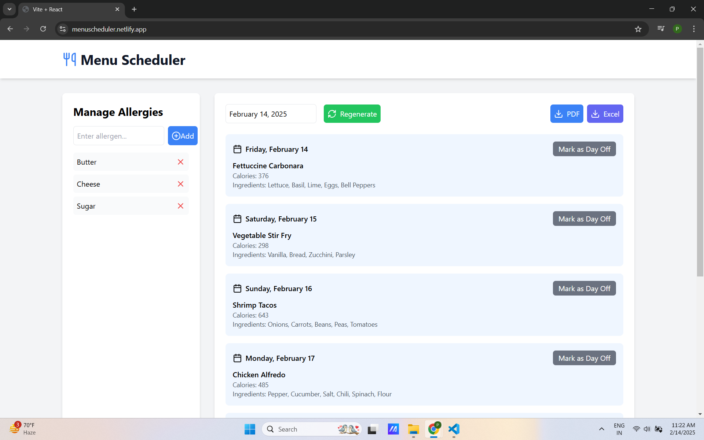

# Menu Scheduler

## [LIVE Demo](https://menuscheduler.netlify.app/)

## Project Overview

Menu Scheduler is a web application project that focuses on developing a menu scheduling application that allows managers to create and share weekly menus for staff workers. The application ensures employees have clear visibility of the planned meals while addressing specific dietary restrictions and allergies.

## How to run locally :

- Clone this repo
- Open a terminal and go to the project folder (here, it is `V53-tier2-team-22`)
- Now, `npm install`
- Then, `npm run dev`

**If you have followed the above steps, your project should be running on localhost**

## Features :

## 1. The app has two main components:

* AllergyManager: Allows users to add/remove allergens, storing them in localStorage.
* WeeklyScheduler: Fetches dish data from an API, filters out allergens, and creates a weekly meal plan. Users can export the plan to PDF or Excel.

## 2. Folder Structure
* src/components/AllergyManager.jsx → Manages allergies
* src/components/WeeklyScheduler.jsx → Generates and displays a weekly meal plan
* src/utils/api.js → Fetches dishes from an API
* src/utils/storage.js → Saves/retrieves allergy data from localStorage
* src/App.js → Main app structure
* src/index.css → Tailwind CSS for styling
* src/main.jsx → Renders the root React component
* index.html → Entry point for the app

## 3. Components Breakdown

### A. AllergyManager.jsx (Managing Allergies)

* Uses useState to store allergy data.
* Retrieves stored allergies from localStorage (getAllergies).

#### Allows users to:

* Add a new allergen (saved to localStorage).
* Remove an allergen from the list.
* Updates state and storage on any change.

### B. WeeklyScheduler.jsx (Meal Planning)

* Uses useState and useEffect to fetch dish data and generate a schedule.
* Fetches dishes from https://menus-api.vercel.app/dishes.
* Filters dishes based on stored allergens (i.e., avoids meals containing allergens).
* Generates a weekly meal schedule (randomized).

#### Allows users to:

* Mark a day as "Day Off" (no meal assigned).
* Regenerate the schedule with new dishes.
* Export the schedule to: PDF using jsPDF and Excel using xlsx

### C. api.js (Fetching Dish Data)

* Fetches dish data from an external API.
* Handles errors if fetching fails.

### D. storage.js (Storing Allergies)

* Saves/retrieves allergy data from localStorage.

## 4. App.js (Main Layout)

Displays:
* Header (Menu Scheduler title)
* AllergyManager
* WeeklyScheduler
* Uses Tailwind CSS for styling.

## 5. Other Setup Files

* index.css → Uses Tailwind CSS utilities.
* main.jsx → Renders <App /> inside #root (React's entry point).
* index.html → Defines the root div where the app is injected.

## 6. How the App Works

* User adds allergies → Stored in localStorage.
* Dishes are fetched from API.

Schedule is generated:
* Filters out dishes containing allergens.
* Randomly assigns meals to each day.

User can modify the schedule:
* Mark a day off.
* Regenerate meals.
* Export to PDF/Excel.
* Data persists (Allergies stored in localStorage).

## 7. Technologies Used

* React (State management, Hooks)
* Tailwind CSS (Styling)
* date-fns (Date formatting)
* lucide-react (Icons)
* jsPDF & xlsx (Exporting data)
* Vite (React bundler)

## 8. Summary

This is a React-based meal planning app that: ✔️ Manages food allergies
✔️ Fetches dishes from an API
✔️ Generates a weekly meal plan
✔️ Allows modifications (day off, regeneration)
✔️ Exports schedules to PDF & Excel
✔️ Uses localStorage to persist allergy data

## Show your support

📌 Please feel free to contribute to this project with your commits

Give a ⭐ if you like this website! You can fork it and contribute

## Can I contribute?

Sure, open an issue, point out errors, and what not? Wanna fix something yourselves? You're welcome to open a PR.

## The Team -

**Product Owner cum Developer** - Prakash Das [Github](https://github.com/prakshh) 

**Developer** - Vasanthakumar [Github](https://github.com/cpvasanth)
